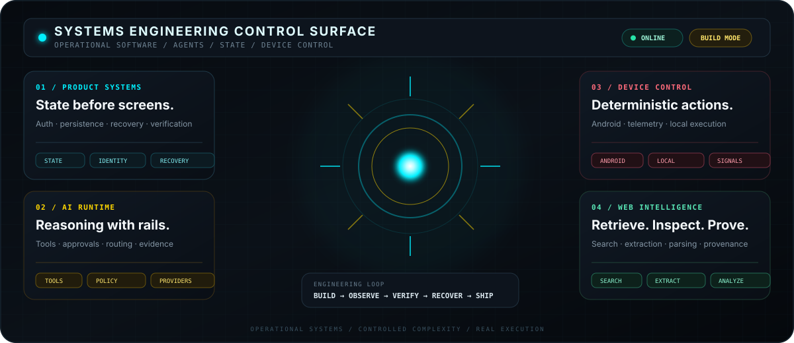
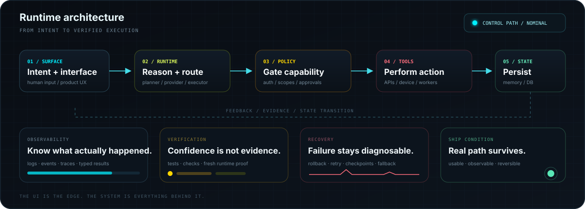
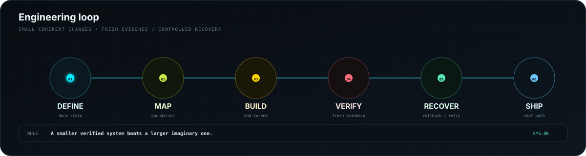

  

  <h2>Ike Shanto</h2>
  
<strong>Systems Engineering · AI Runtimes · Product Infrastructure · Android Control</strong>

  

    I build software as an operating system of decisions, state, tools, permissions, recovery, and proof. 
    The interface matters. The machinery behind it matters more.
  

  
  
  
  

  

  

## Engineering surface

I am interested in the point where a polished interface stops being a mockup and becomes a **real operational system**.

**Product systems** — authentication, ownership, persistence, workflows, recovery, verification, and the state transitions that make the product behave correctly outside the happy path.

**AI runtimes** — tool-using assistants, provider routing, approvals, memory, typed execution, and boundaries that keep model reasoning separate from deterministic actions.

**Android + device control** — phone-first software where known device operations stay local and predictable, while reasoning is used only where it actually adds value.

**Web intelligence** — retrieval, extraction, parsing, structured analysis, provenance, and reusable research pipelines that remain inspectable instead of turning into an opaque scraper pile.

 

  

## What sits behind the interface

A system becomes interesting when the visible UI is backed by explicit control.

- **State has an owner.** Important transitions should not depend on accidental component behavior.
- **Permissions are part of the architecture.** Capability should be granted deliberately, not implied by convenience.
- **Tools return evidence.** An action is not complete because a model says it probably worked.
- **Providers can fail.** Routing, fallback, retries, and degraded states are product behavior.
- **Recovery is designed early.** Checkpoints, rollback, and diagnosable failure are easier to build before everything becomes tangled.
- **Verification closes the loop.** The real runtime path is the source of truth.

<strong>Deeper runtime principles</strong>

 

### Models reason; systems govern

Reasoning is useful for ambiguity, planning, interpretation, and choosing between valid paths. Deterministic operations should still live behind explicit tools, schemas, permission checks, and observable results.

### Failure should become state, not mystery

External APIs, databases, authentication, device operations, networks, and model providers will fail eventually. A good runtime turns those failures into named states that can be inspected, retried, recovered, or surfaced honestly.

### Product architecture is interaction design too

Loading, retries, stale state, permissions, partial success, recovery, and background execution all shape what the product feels like. Backend behavior is part of UX.

 

## Toolchain

  

  

<strong>How I think about the stack</strong>

 

**Interface**  
React · Next.js · Android UI · terminal surfaces · information architecture

**Runtime**  
TypeScript / Node · Python · Go · Kotlin · workers · command execution · provider orchestration

**State**  
PostgreSQL · Prisma · durable workflows · memory · checkpoints · event/evidence records

**Control**  
Authentication · permission boundaries · approvals · provider health · verification · recovery · auditability

 

  

## Build discipline

I prefer a smaller coherent system that survives real use over a larger system that only looks complete in screenshots.

1. **Define** what observable state actually counts as done.
2. **Map** ownership, dependencies, permissions, and failure modes.
3. **Build** the smallest complete end-to-end path.
4. **Observe** what the runtime really does.
5. **Verify** with fresh evidence instead of assumption.
6. **Recover** cleanly when the path breaks.
7. **Ship** when the real path survives contact with reality.

### Current vector

`products → agents → tools → controlled execution → evidence → reliable systems`

The direction is simple: **less demo behavior, more systems that can explain what happened and keep working when conditions stop being perfect.**

  

  <strong>BUILD · OBSERVE · VERIFY · RECOVER · SHIP</strong> 
  Designed interfaces. Controlled capability. Recoverable state. Provable completion.

 

  

<!--
PUBLIC PROFILE NOTES
- Keep personal-identifying details off the public profile.
- Keep project-specific private architecture out of this README.
- No repository showcase section here; the profile should communicate engineering identity, not become a project index.
-->
