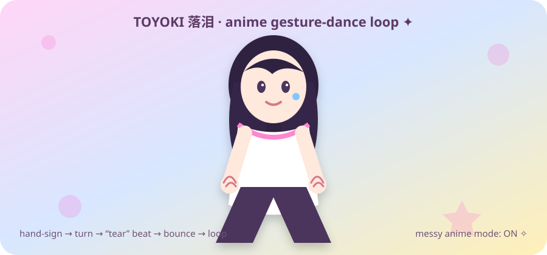

  

<h1 align="center">✦ SEONGJA.EXE — ANIME CHAOS PROFILE ✦</h1>

  <b>systems • code • agents • anime • late-night ideas • suspicious amounts of tabs</b> 
  professional enough to ship. messy enough to be alive.

🌸　✨　🎧　🧠　🧃　💻　🛸　🎀　⚡　🌙　🫧

<table>
<tr>
<td width="34%" align="center">
  
</td>
<td width="32%" align="center">
  <b>WELCOME TO THE DESKTOP</b>  
  <code>status: probably building something</code> 
  <code>theme: anime clutter</code> 
  <code>brain: 47 tabs</code> 
  <code>sleep: optional DLC</code>  
  ✧ AI systems 
  ✧ web products 
  ✧ automation 
  ✧ Android / terminal 
  ✧ weird experiments
</td>
<td width="34%" align="center">
  
</td>
</tr>
</table>

---

<h2 align="center">🎵 TOYOKI MODE — 我真的特别爱你 / 落泪</h2>

  

  <i>gesture → turn → fake-tear beat → bounce → loop</i> 
  inspired by the viral hand-gesture dance format around TOYOKI's 落泪 / “我真的特别爱你，为什么你会落泪”

---

<table>
<tr>
<td align="center"></td>
<td align="center"></td>
<td align="center"></td>
<td align="center"></td>
</tr>
</table>

<h2>🧠 currently occupying the brain</h2>

- building **AI runtimes** that can actually call tools, recover, verify and keep state
- making **web products** that feel less like templates and more like worlds
- wiring together **agents, APIs, databases, browsers, terminals and automation**
- breaking UI, fixing UI, breaking it differently
- trying ideas that sound stupid until they work
- making everything unnecessarily anime when the mood wins

  

<h2 align="center">☆ tech pile ☆</h2>

  

  <code>TypeScript</code> · <code>Python</code> · <code>Next.js</code> · <code>Node</code> · <code>Postgres</code> ·
  <code>agents</code> · <code>MCP</code> · <code>automation</code> · <code>Android</code>

---

<table>
<tr>
<td width="50%" valign="top">

### 🎀 system philosophy

> models can reason.  
> tools should prove.  
> state should have an owner.  
> failures should become inspectable state instead of mystery.

I like systems where the pretty surface has **real machinery underneath it**.

</td>
<td width="50%" valign="top">

### 🌙 operating conditions

- headphones probably on
- terminal probably open
- one idea becoming five
- one bug becoming seventeen
- UI screenshots everywhere
- anime girl supervising production

</td>
</tr>
</table>

  
  

<b>📂 open the suspicious folder</b>

 

### tiny rules inside the machine

- **Build the real path**, not just the screenshot.
- **Verify external actions** instead of trusting a success-looking message.
- **Assume APIs fail**, because eventually they will.
- **Keep permissions explicit**.
- **Recovery is a feature**.
- **A clean UI cannot save a broken runtime.**
- **A strong runtime still deserves a clean UI.**
- **Anime clutter is exempt from minimalism.**

 

<h2 align="center">💿 BUILD LOG // chaotic edition</h2>

  <code>idea</code> → <code>prototype</code> → <code>break it</code> → <code>inspect</code> → <code>fix</code> → <code>ship</code> → <code>make it prettier</code> → <code>break it again</code>

🌸 ˚₊‧꒰ა ☆ ໒꒱ ‧₊˚ 🌸

<table>
<tr>
<td align="center"></td>
<td align="center">
  <b>current vector</b>  
  <code>products → agents → tools → execution → evidence → weirdly reliable systems</code>  
  and somewhere in the architecture: 
  <b>anime.</b>
</td>
<td align="center"></td>
</tr>
</table>

  

### ✦ RANDOM ACCESS MEMORY ✦

<code>コード</code>　<code>AI</code>　<code>夜</code>　<code>音楽</code>　<code>実験</code>　<code>アニメ</code>　<code>システム</code>　<code>混沌</code>

**BUILD · OBSERVE · VERIFY · RECOVER · SHIP · DECORATE WITH ANIME GIRLS**

if this README looks slightly unhinged, it is rendering correctly.

<!--
PUBLIC PROFILE NOTES
- Keep private/personal identifying details off the public profile.
- Keep private project architecture and credentials out of this README.
- Visual direction: intentionally cluttered anime desktop / webcore.
-->
