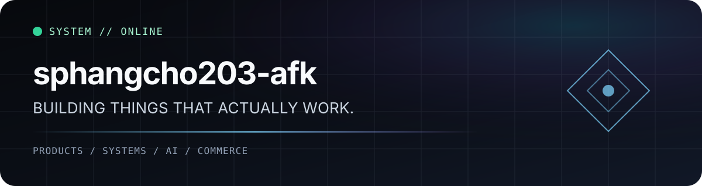

<div align="center">



<br />

### I turn unfinished ideas into working systems.

`PRODUCT ENGINEERING` · `AI` · `FULL-STACK` · `COMMERCE` · `AGENTS`

</div>

---

## // CURRENT SIGNAL

I build products end-to-end — interface, backend, database, integrations, deployment, and the annoying parts that appear only after something reaches production.

Right now the main focus is **Recharza**: a game top-up platform built around real purchase flows, account validation, checkout, orders, admin tooling, and production infrastructure.

I also experiment with AI systems, agent workflows, developer tooling, and interfaces that feel less like templates and more like actual products.

> Quiet profile. Loud systems.

---

## // SELECTED BUILDS

<table>
<tr>
<td width="33%" valign="top">

### ⚡ Recharza
**Digital game commerce platform**

A production-oriented top-up system covering game selection, account validation, cart, checkout, payment flow, order lifecycle, customer accounts, and staff/admin operations.

`Next.js` `React` `TypeScript` `PostgreSQL` `Prisma`

</td>
<td width="33%" valign="top">

### ◈ AI Chatbot
**Full-stack AI workspace**

A deployed conversational platform with authentication, persistent conversations, configurable model access, database-backed state, and production infrastructure.

`Next.js` `React` `Prisma` `PostgreSQL` `AI APIs`

</td>
<td width="33%" valign="top">

### ◉ Agent Systems
**Tools that operate, not just answer**

Experiments around Telegram agents, MCP-style tool layers, function bridges, automation, and systems that can interact with real product infrastructure.

`TypeScript` `Node.js` `MCP` `Agents` `APIs`

</td>
</tr>
</table>

---

## // HOW I BUILD

```text
01  Understand the actual problem
02  Remove contradictory architecture
03  Build the smallest coherent system
04  Test the real workflow
05  Deploy it
06  Break it on purpose
07  Fix what production exposes
08  Repeat
```

I care more about **working systems** than impressive-looking code.

That means:

- frontend and backend are treated as one product
- UI polish does not excuse broken flows
- security is not a "later" task
- production behavior outranks assumptions
- dead architecture gets deleted instead of decorated
- tools should reduce work, not create more dashboards to manage

---

## // OPERATING STACK

<table>
<tr>
<td><strong>Frontend</strong></td>
<td>Next.js · React · TypeScript · modern CSS · responsive product UI</td>
</tr>
<tr>
<td><strong>Backend</strong></td>
<td>Node.js · server routes/actions · API integrations · auth · webhooks</td>
</tr>
<tr>
<td><strong>Data</strong></td>
<td>PostgreSQL · Prisma · relational modeling · migrations</td>
</tr>
<tr>
<td><strong>Infrastructure</strong></td>
<td>Vercel · GitHub · managed Postgres · environment/config management</td>
</tr>
<tr>
<td><strong>AI / Agents</strong></td>
<td>model APIs · tool calling · MCP-style systems · automation · agent workflows</td>
</tr>
<tr>
<td><strong>Environment</strong></td>
<td>Android · Termux · Linux/proot · CLI-first workflows</td>
</tr>
</table>

---

## // DESIGN PRINCIPLE

```text
premium ≠ empty
modern  ≠ purple glow
complex ≠ confusing
AI      ≠ magic
shipped > imagined
```

I like interfaces with strong hierarchy, game/product identity, deliberate motion, clear states, and enough personality to be recognizable without becoming noisy.

---

## // STATUS

```yaml
mode: building
main_focus: recharza
preferred_state: production
favorite_bug: the one already reproduced
response_to_dead_code: delete
```

---

<details>
<summary><strong>// PROFILE NOTE</strong></summary>
<br />

This profile intentionally keeps personal contact information, location, and cross-platform identity links out of the public README.

The work can be public without turning the person behind it into a public dataset.

</details>

<br />

<div align="center">

`BUILD → VERIFY → SHIP → ITERATE`

<sub>Less biography. More output.</sub>

</div>
