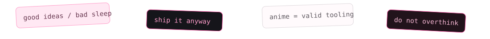

  

  

<table>
<tr>
<td width="17%" align="center" valign="middle">
  
</td>
<td width="66%" valign="middle">

## hey, i'm Seongja ♡

I build **AI systems, web products, automation, tool runtimes, integrations and experiments** — usually with too many tabs open and at least one idea becoming five.

<code>systems</code> · <code>code</code> · <code>anime</code> · <code>games</code> · <code>late nights</code>

> trying to make software feel less generic and more alive.

</td>
<td width="17%" align="center" valign="middle">
  
</td>
</tr>
</table>

---

<table>
<tr>
<td width="48%" valign="top">

### $ whoami

<pre>
&gt; anime enjoyer
&gt; builder
&gt; systems thinker
&gt; jungle main
&gt; terminal resident
&gt; still figuring it out...
</pre>

</td>
<td width="52%" valign="top">

### 🧠 currently in RAM

- [x] build useful things
- [x] connect tools that normally do not talk
- [x] make interfaces feel intentional
- [x] verify the real execution path
- [ ] finish one idea before spawning five
- [ ] make sleep.exe behave normally

</td>
</tr>
</table>

<table>
<tr>
<td width="15%" align="center">
  
</td>
<td width="85%" valign="middle">

### tiny rules inside the machine

**models reason; tools prove** · state needs an owner · failures should be inspectable · recovery is a feature · screenshots are not proof · strange ideas deserve prototypes

</td>
</tr>
</table>

---

## &lt;/&gt; tech stack

  

  <code>agents</code>
  <code>MCP</code>
  <code>APIs</code>
  <code>automation</code>
  <code>Android</code>
  <code>tool calling</code>
  <code>web systems</code>

---

## ☆ things I'm building

<table>
<tr>
<td width="33%" valign="top">

### 🎮 [Recharza](https://github.com/sphangcho203-afk/recharza-platform)
Game top-up platform with a full storefront/runtime stack.

Next.js · TypeScript · Postgres

</td>
<td width="33%" valign="top">

### 🤖 [Nexus](https://github.com/sphangcho203-afk/ai-chatbot-v1)
Multi-user AI chatbot with routing and user-owned tools.

AI · Agents · Next.js

</td>
<td width="33%" valign="top">

### ⚙️ [Telegram Agent OS](https://github.com/sphangcho203-afk/telegram-agent-os)
Telegram-native agent experiments with MCP execution.

Telegram · MCP · Automation

</td>
</tr>
</table>

  

<table>
<tr>
<td width="20%" align="center" valign="middle">
  
</td>
<td width="60%" align="center" valign="middle">

## ♪ toyoki mode

<code>hand signs → turn → fake tear → bounce → repeat</code>

tiny dance break between two engineering decisions.

</td>
<td width="20%" align="center" valign="middle">

### now playing

TOYOKI  
anime OSTs  
whatever keeps the terminal alive

</td>
</tr>
</table>

---

<table>
<tr>
<td width="56%" valign="top">

### current vector

<pre>
idea
 ↓
prototype
 ↓
break
 ↓
inspect
 ↓
fix
 ↓
ship
 ↺
</pre>

</td>
<td width="44%" valign="top">

### still building...

♡ cleaner systems  
♡ better interfaces  
♡ stranger experiments  
♡ fewer mysterious bugs  
♡ more things worth shipping

</td>
</tr>
</table>

<b>📁 open the suspicious folder</b>

 

- I care about the real runtime path, not only the screenshot.
- If an external action matters, verify it.
- If an API can fail, the product should know what failure means.
- If state exists, somebody should own it.
- Clean UI and reliable systems should coexist.
- Anime decorations are not a production incident.

 

  

  somewhere between reality and anime, still building.

<!-- public profile only: no credentials, private architecture, or private operational details -->