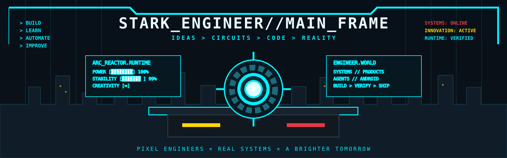
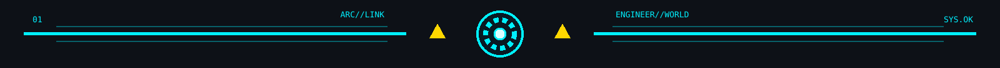
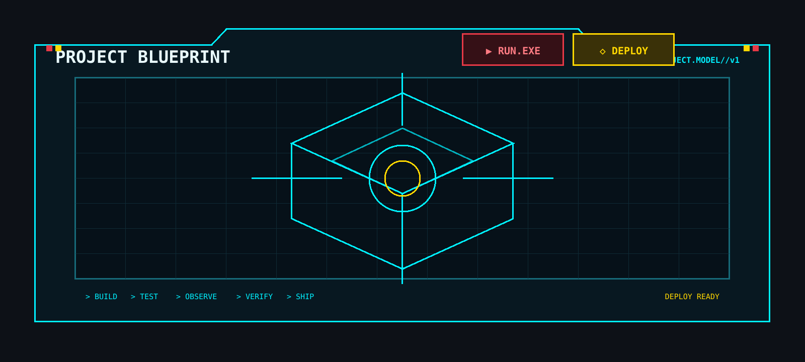
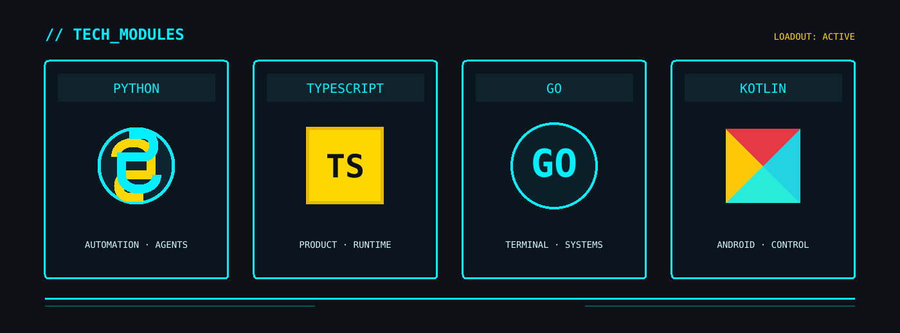
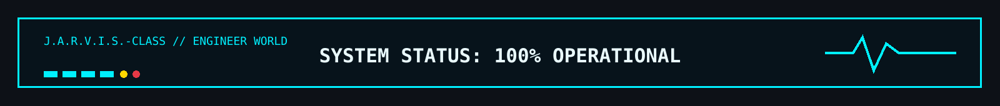

<p align="center">
  
</p>

<div align="center">
  <sub><strong>SYSTEMS ENGINEERING · AI RUNTIMES · PRODUCT INFRASTRUCTURE · ANDROID CONTROL</strong></sub><br/>
  <sub>Building interfaces, agents, tools, runtimes, and the control systems that keep them real.</sub>
</div>

<br/>

<p align="center">
  <a href="#-main_frame"><strong>MAIN_FRAME</strong></a>
  · <a href="#-active_systems">SYSTEMS</a>
  · <a href="#-tech_modules">TECH</a>
  · <a href="#-system_blueprint">BLUEPRINT</a>
  · <a href="#-engineering_protocol">PROTOCOL</a>
  · <a href="#-archive_index">ARCHIVE</a>
</p>

<p align="center">
  <code>BUILD</code> × <code>AUTOMATE</code> × <code>OBSERVE</code> × <code>VERIFY</code> × <code>SHIP</code>
</p>

<p align="center">
  
</p>

## `// MAIN_FRAME`

<table>
<tr>
<td width="58%" valign="top">

### ENGINEERING DIRECTIVE

I build **complete operational systems**, not isolated demos.

The interesting part starts after the interface renders: state ownership, authentication, tools, provider routing, permissions, persistence, recovery, observability, verification, and deployment.

A system is not finished because its happy path works once. It is finished when the runtime can explain what happened, recover from failure, and prove the result.

> **Models can propose. Deterministic systems still need to govern.**

</td>
<td width="42%" valign="top">

### RUNTIME STATE

```text
PRODUCT SYSTEMS    [ ACTIVE ]
AI / AGENT RUNTIME [ ACTIVE ]
ANDROID CONTROL    [ ACTIVE ]
WEB INTELLIGENCE   [ LAB    ]
AUTOMATION         [ ACTIVE ]
VERIFICATION       [ ALWAYS ]
```

**Current vector**  
`products → agents → tools → evidence → reliable execution`

</td>
</tr>
</table>

### SIGNAL LEGEND

| Signal | Meaning |
|---|---|
| `CORE` | End-to-end system with meaningful product/runtime behavior |
| `ACTIVE` | Under active development or operational iteration |
| `ALPHA` | Functional architecture with unfinished edges explicitly labelled |
| `LAB` | Focused experiment used to test a systems idea |
| `SEALED` | Real private system; architecture may be described without exposing source |

<br/>

## `// ACTIVE_SYSTEMS`

<p align="center">
  
</p>

<table>
<tr>
<td width="50%" valign="top">

### 01 — [NEXUS FORGE](https://github.com/sphangcho203-afk/nexus-forge)
`ACTIVE` · `ALPHA` · ENGINEERING AGENT RUNTIME

Provider-independent engineering intelligence for the terminal, built around **governed execution** instead of unrestricted model access.

**Runtime surface**
- mission contracts and observable done conditions
- dependency-aware work graphs
- typed tools and permission gates
- provider / coding-agent bridges
- checkpoints, rollback, and durable evidence
- failure classification and targeted recovery
- completion gates based on verification

**Core split**  
`Python` · `Go` · `typed tools` · `durable event/evidence state`

</td>
<td width="50%" valign="top">

### 02 — [JARVIS APP](https://github.com/sphangcho203-afk/JarvisApp)
`ACTIVE` · ANDROID ASSISTANT RUNTIME

A phone-first assistant where known device operations stay deterministic and cloud reasoning is used only when reasoning is actually required.

**Execution surface**
- local action kernel
- voice interaction
- explicit system-control boundaries
- typed results returned to the HUD
- device telemetry and actions
- provider failover
- protected provider configuration

**Core split**  
`Kotlin` · `Android APIs` · `local execution` · `provider mesh`

</td>
</tr>
<tr>
<td width="50%" valign="top">

### 03 — [WEB SCRAPPING CLI](https://github.com/sphangcho203-afk/Web-Scrapping-CLI)
`LAB` · WEB INTELLIGENCE TOOLING

A public web-intelligence CLI for search, fetch, extraction, parsing, and analysis workflows while keeping access boundaries, source provenance, and failure states explicit.

**Direction**
- normalized search / fetch routes
- structured extraction
- content analysis pipelines
- reusable agent-facing tools
- observable request / result boundaries

**Design problem:** make web research programmable without turning the runtime into an opaque pile of scrapers.

</td>
<td width="50%" valign="top">

### 04 — [NOVA COMMAND](https://github.com/sphangcho203-afk/nova-command)
`LAB` · MISSION CONTROL

A command-oriented surface for turning scattered projects, tasks, ideas, and execution state into one operational view.

**Focus**
- project state at a glance
- task and mission tracking
- idea capture without losing execution context
- command-center information hierarchy
- reducing switching cost between planning and doing

**Design problem:** expose enough state to make decisions without making the dashboard itself another system to babysit.

</td>
</tr>
</table>

### SEALED CORE SYSTEMS

| System | Classification | Primary engineering problem |
|---|---|---|
| **Recharza** | `CORE / SEALED` | commerce state, identity, checkout, payment boundaries, fulfilment, recovery |
| **AI Chatbot Runtime** | `ACTIVE / SEALED` | owner-controlled agent UI, provider routing, tools, approvals, auth and model orchestration |

<br/>

<p align="center">
  
</p>

## `// TECH_MODULES`

<p align="center">
  
</p>

<table>
<tr>
<td width="25%" valign="top">
<strong>INTERFACE</strong><br/>
<sub>
React<br/>
Next.js<br/>
Android / Kotlin UI<br/>
terminal UI<br/>
information architecture
</sub>
</td>
<td width="25%" valign="top">
<strong>RUNTIME</strong><br/>
<sub>
TypeScript / Node<br/>
Python<br/>
Go<br/>
Kotlin<br/>
workers + command execution
</sub>
</td>
<td width="25%" valign="top">
<strong>STATE</strong><br/>
<sub>
PostgreSQL<br/>
Prisma<br/>
mission ledgers<br/>
orders<br/>
memory + checkpoints
</sub>
</td>
<td width="25%" valign="top">
<strong>CONTROL</strong><br/>
<sub>
permissions<br/>
auth boundaries<br/>
provider health<br/>
verification<br/>
recovery + auditability
</sub>
</td>
</tr>
</table>

### SYSTEM LOADOUT

`TypeScript` · `Python` · `Go` · `Kotlin` · `React` · `Next.js` · `Node.js` · `PostgreSQL` · `Prisma` · `Android APIs` · `Vercel` · `GitHub Actions`

<br/>

## `// SYSTEM_BLUEPRINT`

The products change. The control shape keeps returning.

```text
                         ┌─────────────────────┐
USER / OPERATOR ───────► │   PRODUCT SURFACE   │
                         └──────────┬──────────┘
                                    │
                                    ▼
                         ┌─────────────────────┐
                         │ EXECUTION / RUNTIME │
                         └──┬──────┬──────┬────┘
                            │      │      │
                 ┌──────────┘      │      └──────────┐
                 ▼                 ▼                 ▼
        ┌────────────────┐ ┌──────────────┐ ┌────────────────┐
        │ STATE / MEMORY │ │ TOOLS / APIs │ │ POLICY / AUTH  │
        └────────┬───────┘ └──────┬───────┘ └───────┬────────┘
                 └──────────────┬──┴─────────────────┘
                                ▼
                     ┌─────────────────────┐
                     │ OBSERVE + VERIFY    │
                     └──────────┬──────────┘
                                │
                 ┌──────────────┴──────────────┐
                 ▼                             ▼
          SUCCESS / SHIP                FAILURE / RECOVER
```

### WHY THIS SHAPE

Authentication, external providers, persistent state, payments, device control, tool execution, and AI output all create failure modes. The control plane turns those failures into **explicit states** instead of mystery behavior.

<br/>

## `// ENGINEERING_PROTOCOL`

```text
┌─ BUILD CONTRACT ─────────────────────────────────────────────────────────┐
│                                                                         │
│  01  DEFINE     observable state that counts as done                    │
│  02  MAP        dependencies, ownership, boundaries, failure modes      │
│  03  BUILD      smallest coherent end-to-end change                     │
│  04  OBSERVE    inspect actual runtime behavior                         │
│  05  VERIFY     prove the change against fresh evidence                 │
│  06  RECOVER    keep failure diagnosable and reversible                │
│  07  SHIP       only after the real path survives                       │
│                                                                         │
└─────────────────────────────────────────────────────────────── SYS.OK ─┘
```

### NON-NEGOTIABLES

| Domain | Standard |
|---|---|
| Product | The real user path matters more than isolated screens |
| Frontend | Hierarchy and flow before component accumulation |
| Backend | State ownership must be explicit |
| AI | Models reason; deterministic code owns deterministic actions |
| Tools | Capability is bounded by permissions and scope |
| Providers | Failure is expected; routing and recovery are product behavior |
| Security | Ambiguous privilege should fail closed |
| Verification | Confidence is not evidence |
| Shipping | A smaller verified system beats a larger imaginary one |

<br/>

## `// ARCHIVE_INDEX`

| Archive | Signal | Surface |
|---|---|---|
| **NEXUS FORGE** | `ACTIVE / ALPHA` | [repository](https://github.com/sphangcho203-afk/nexus-forge) |
| **Jarvis App** | `ACTIVE` | [repository](https://github.com/sphangcho203-afk/JarvisApp) |
| **Web Scrapping CLI** | `LAB` | [repository](https://github.com/sphangcho203-afk/Web-Scrapping-CLI) |
| **Nova Command** | `LAB` | [repository](https://github.com/sphangcho203-afk/nova-command) |
| **Socializing** | `PUBLIC` | [repository](https://github.com/sphangcho203-afk/Socializing-) |
| **Recharza** | `CORE / SEALED` | private runtime |
| **AI Chatbot Runtime** | `ACTIVE / SEALED` | private runtime |

### CURRENT THEMES

`governed agents` · `tool execution` · `evidence-backed completion` · `product infrastructure` · `Android control` · `stateful workflows` · `provider resilience` · `web intelligence` · `designed interfaces`

<br/>

<p align="center">
  
</p>

## `// TRANSMISSION`

> ### **BUILD THINGS THAT SURVIVE CONTACT WITH REALITY.**
>
> Interfaces should explain the system.  
> Runtimes should constrain capability.  
> State should be recoverable.  
> Completion should be provable.

<p align="center">
  
</p>

<!--
PUBLIC PROFILE DIRECTIVE
- No full legal name.
- No location, school, age, phone, personal email, or document identifiers.
- No cross-platform social graph.
- Public project links only when intentionally exposed.
- Technical/project detail is encouraged; personal-identifying detail is not.
-->
