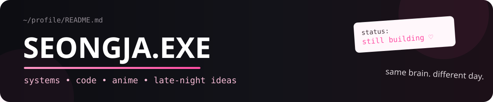
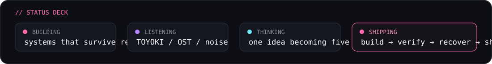

  

  

<table>
<tr>
<td width="18%" align="center" valign="middle">
  
</td>
<td width="64%" valign="middle">

## hey — Seongja here ♡

I build **AI systems, web products, automation, agents, tool runtimes and strange experiments**.

The goal is simple: make things that look good **and** survive the real execution path.

<code>systems</code> · <code>code</code> · <code>anime</code> · <code>games</code> · <code>late nights</code>

</td>
<td width="18%" align="center" valign="middle">
  
</td>
</tr>
</table>

  

<table>
<tr>
<td width="48%" valign="top">

### $ whoami

<pre>
&gt; builder
&gt; anime enjoyer
&gt; systems thinker
&gt; jungle main
&gt; terminal resident
&gt; UI critic
&gt; still building...
</pre>

</td>
<td width="52%" valign="top">

### 🧠 active processes

- [x] build instead of only planning
- [x] connect agents, APIs, DBs and tools
- [x] make interfaces feel intentional
- [x] verify external actions
- [ ] finish one idea before spawning five
- [ ] patch sleep.exe

</td>
</tr>
</table>

  

<table>
<tr>
<td width="17%" align="center" valign="middle">
  
</td>
<td width="83%" valign="middle">

## &lt;/&gt; toolbox

  

<code>agents</code> <code>MCP</code> <code>APIs</code> <code>automation</code> <code>Android</code> <code>tool calling</code> <code>web systems</code>

</td>
</tr>
</table>

---

## ☆ selected builds

<table>
<tr>
<td width="33%" valign="top">

### 🎮 [Recharza](https://github.com/sphangcho203-afk/recharza-platform)
Game top-up platform and storefront system.

Next.js · TypeScript · Postgres

</td>
<td width="33%" valign="top">

### 🤖 [Nexus](https://github.com/sphangcho203-afk/ai-chatbot-v1)
Multi-user AI runtime with routing and user-owned tools.

Agents · Next.js · integrations

</td>
<td width="33%" valign="top">

### ⚙️ [Telegram Agent OS](https://github.com/sphangcho203-afk/telegram-agent-os)
Telegram-native agent + MCP execution experiments.

Telegram · MCP · automation

</td>
</tr>
</table>

  

## signal feed

<table>
<tr>
<td width="50%" align="center">
  
</td>
<td width="50%" align="center">
  
</td>
</tr>
</table>

<table>
<tr>
<td width="21%" align="center" valign="middle">
  
</td>
<td width="58%" align="center" valign="middle">

## ♪ TOYOKI MODE

<code>hand signs → turn → fake tear → bounce → repeat</code>

small dance break between two suspicious engineering decisions.

</td>
<td width="21%" align="center" valign="middle">
  
</td>
</tr>
</table>

  

<table>
<tr>
<td width="58%" valign="middle">

## build loop

</td>
<td width="42%" valign="top">

### operating rules

- **models reason; tools prove**
- state needs an owner
- failures should be inspectable
- recovery is a product feature
- screenshots are not proof
- clean UI ≠ fake functionality
- weird ideas deserve prototypes

</td>
</tr>
</table>

<b>📁 open the suspicious folder</b>

 

<code>idea → prototype → break → inspect → fix → verify → ship → repeat</code>

I care more about the real execution path than the screenshot. If something calls an API, changes external state, handles auth, touches money, or claims success — I want the evidence path to exist too.

 

  

  somewhere between reality and anime, still building. 
  <b>BUILD · OBSERVE · VERIFY · RECOVER · SHIP</b>

<!-- public profile only: no credentials, private architecture, or private operational details -->