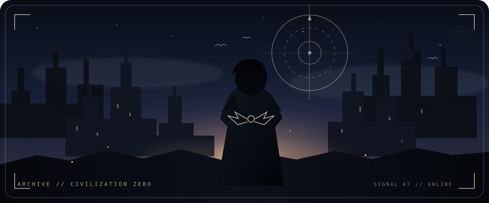
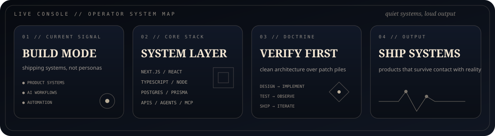
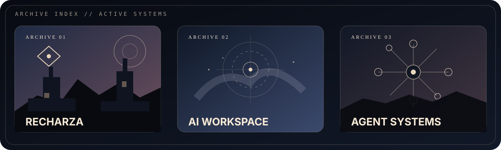
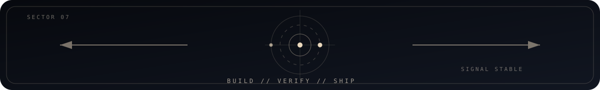

<p align="center">
  
</p>

<div align="center">
  <sub><strong>SYSTEMS ENGINEERING · AI WORKFLOWS · PRODUCT INFRASTRUCTURE</strong></sub><br/>
  <sub>Public identity kept intentionally small. The machines can do the talking.</sub>
</div>

<br/>

## `// OPERATOR CONSOLE`

<p align="center">
  
</p>

<table>
<tr>
<td width="50%" valign="top">

### CURRENT SIGNAL

<kbd>BUILD MODE</kbd> <kbd>PRODUCT SYSTEMS</kbd> <kbd>AGENTS</kbd>

I build full systems instead of isolated demos: product interfaces, APIs, automation layers, data flows, auth, operations tooling, and the infrastructure around them.

The goal is simple: **reduce friction until the product feels inevitable.**

</td>
<td width="50%" valign="top">

### SYSTEM DOCTRINE

<kbd>DESIGN</kbd> → <kbd>IMPLEMENT</kbd> → <kbd>VERIFY</kbd> → <kbd>SHIP</kbd>

Architecture before patch piles. Observable behavior before assumptions. Useful automation before decorative AI. Privacy boundaries before public identity graphs.

> Quiet profile. Loud output.

</td>
</tr>
</table>

<br/>

## `// SELECTED SYSTEMS`

<p align="center">
  
</p>

<table>
<tr>
<td width="50%" valign="top">

### 01 — RECHARZA
**Private core system**

Game-commerce infrastructure built around real account, validation, cart, checkout, payment, order, support, and operations flows.

`Next.js` · `React` · `PostgreSQL` · `Prisma` · `APIs`

</td>
<td width="50%" valign="top">

### 02 — [NEXUS FORGE](https://github.com/sphangcho203-afk/nexus-forge)
**Public interface experiment**

A visual systems lab for dimensional interfaces, frontend architecture, tools, presentation, and experimental product surfaces.

`Frontend` · `Design systems` · `Tooling`

</td>
</tr>
<tr>
<td width="50%" valign="top">

### 03 — [NOVA COMMAND](https://github.com/sphangcho203-afk/nova-command)
**Public control-layer experiment**

Command-oriented experiments around automation, structured operations, orchestration, and agent-friendly control surfaces.

`Automation` · `Commands` · `Agentic systems`

</td>
<td width="50%" valign="top">

### 04 — [JARVIS APP](https://github.com/sphangcho203-afk/JarvisApp)
**Public assistant-interface experiment**

Exploration of assistant UX, contextual workflows, control surfaces, and calm operator-style interaction.

`Assistant UI` · `Context` · `Workflows`

</td>
</tr>
</table>

<br/>

## `// BUILD LAYERS`

<table>
<tr>
<td width="25%" align="center"><strong>INTERFACE</strong><br/><sub>React · Next.js<br/>product UI · systems UX</sub></td>
<td width="25%" align="center"><strong>RUNTIME</strong><br/><sub>TypeScript · Node<br/>APIs · workers · automation</sub></td>
<td width="25%" align="center"><strong>DATA</strong><br/><sub>PostgreSQL · Prisma<br/>state · persistence · auditability</sub></td>
<td width="25%" align="center"><strong>INTELLIGENCE</strong><br/><sub>agents · tools · MCP<br/>context · orchestration</sub></td>
</tr>
</table>

```text
┌─ CIVILIZATION ZERO / BUILD PIPELINE ─────────────────────────────────────┐
│                                                                         │
│   problem ──► architecture ──► interface ──► runtime ──► verification   │
│      ▲                                                        │         │
│      └────────────────── observation ◄────────────────────────┘         │
│                                                                         │
└────────────────────────────────────────────────────────── signal: live ┘
```

<details>
<summary><strong>MANIFEST // WHAT I OPTIMIZE FOR</strong></summary>
<br/>

| Layer | Standard |
|---|---|
| Product | Useful before impressive |
| Architecture | Clear boundaries before clever abstractions |
| AI | Tool use and workflows before chatbot theatre |
| Backend | Observable, recoverable, boring where boring wins |
| Frontend | Designed composition, not component soup |
| Security | Fail closed; expose less; rotate what matters |
| Privacy | Public work can exist without a public personal graph |
| Shipping | Small verified improvements beat endless redesign loops |

</details>

<br/>

### `// TRANSMISSION`

> **Build things that survive contact with reality.**  
> Then remove whatever does not need to be public.

<p align="center">
  
</p>

<!--
PUBLIC PROFILE DIRECTIVE
- No full legal name.
- No location, school, age, phone, personal email, or document identifiers.
- No cross-platform social graph.
- Public project links only when intentionally exposed.
- Let the work carry the identity.
-->
