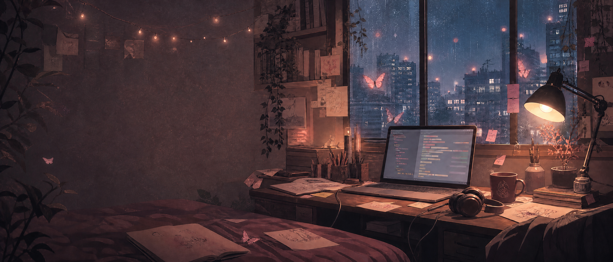
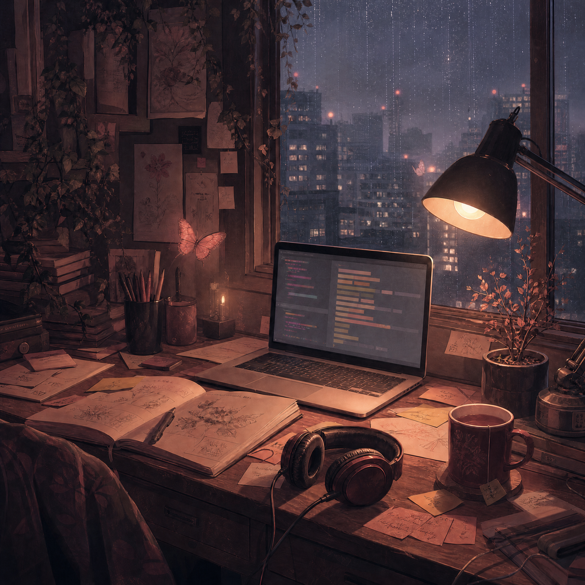
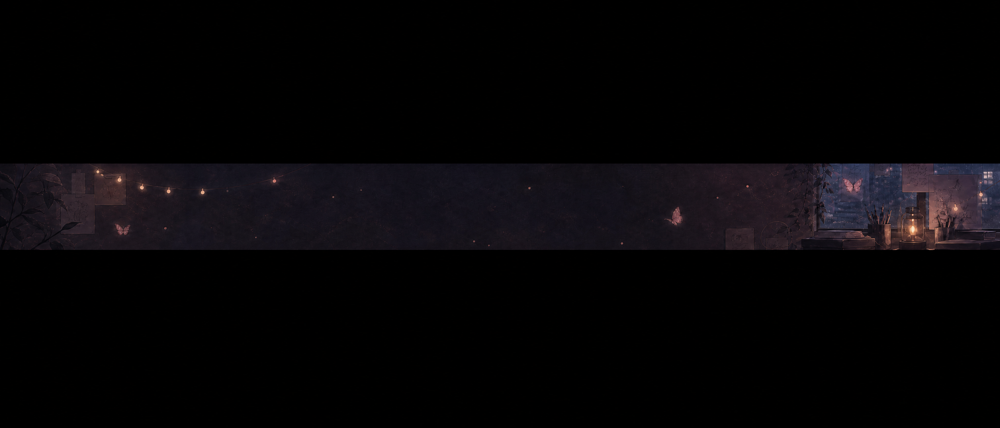

  

  

<h1 align="center">
  <b>Songja Phangcho</b> 
  <code>sphangcho203-afk</code>
</h1>

  <i>building little things inside a big, slightly messy digital world.</i>

  
  
  

  

## hi, welcome in

This is my small corner of the internet. I like backend systems, APIs, Android projects, bots, automation, and ideas that begin as a messy note and slowly become something real.

I am still learning, still experimenting, and still leaving half-finished sketches around the room. Some projects are practical. Some are curious. Some are just here because I wanted to see if I could make them work.

> no perfect plan — just a desk, a few ideas, and another small thing to build.

## the palette in this room

  
  
  
  
  

A little dark, a little warm, and not too polished — like the room where these projects usually begin.

## things currently on my desk

| Area | What I am exploring |
| --- | --- |
| **Backend** | APIs, services, data flow, and small tools that make other things easier |
| **Android** | Kotlin apps, personal assistants, and quiet experiments for everyday use |
| **Automation** | Bots, integrations, scripts, and workflows that remove repetitive steps |
| **Creative coding** | Tiny interfaces, unusual ideas, and projects that do not need a category yet |

## projects from this little world

| Project | What it is |
| --- | --- |
| [ign-api](https://github.com/sphangcho203-afk/ign-api) | A TypeScript API for looking up game information |
| [ign-lookup-api](https://github.com/sphangcho203-afk/ign-lookup-api) | A Python project for multi-game player lookups |
| [recharz](https://github.com/sphangcho203-afk/recharz) | A multi-game top-up and service experiment |
| [JarvisApp](https://github.com/sphangcho203-afk/JarvisApp) | A personal Android assistant experiment |
| [nexus-forge](https://github.com/sphangcho203-afk/nexus-forge) | A student-led terminal engineering project |
| [nova-command](https://github.com/sphangcho203-afk/nova-command) | A small mission-control style dashboard |
| [novaclash-bot](https://github.com/sphangcho203-afk/novaclash-bot) | A Discord bot for the Nova Clash community |

## tools I keep nearby

  
  
  
  
  
  
  
  

## little bits of activity

  
  

  
  

  

## currently

- learning by making things
- collecting ideas in too many notes
- fixing old projects when I remember them
- leaving room for the next weird little experiment

  

  <i>thanks for visiting my little world.</i> 
  Songja · AFK sometimes · probably near a window with rain outside

