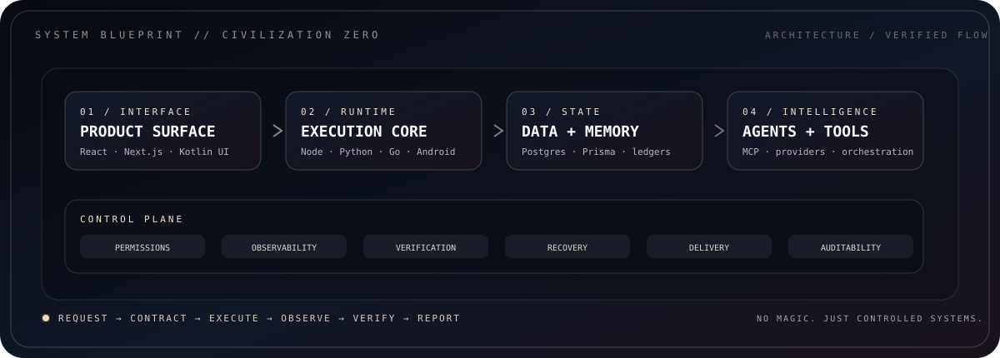

<p align="center">
  
</p>

<div align="center">
  <sub><strong>SYSTEMS ENGINEERING · AI RUNTIMES · PRODUCT INFRASTRUCTURE · ANDROID CONTROL</strong></sub><br/>
  <sub>An engineering archive for products, agents, runtimes, interfaces, and the control systems around them.</sub>
</div>

<br/>

<p align="center">
  <a href="#-operator-console"><strong>Operator Console</strong></a>
  · <a href="#-selected-systems">Systems</a>
  · <a href="#-system-blueprint">Blueprint</a>
  · <a href="#-capability-matrix">Capability Matrix</a>
  · <a href="#-engineering-protocol">Protocol</a>
  · <a href="#-archive-index">Archive</a>
</p>

---

## `// OPERATOR CONSOLE`

<p align="center">
  
</p>

<table>
<tr>
<td width="50%" valign="top">

### ACTIVE DOMAIN

<kbd>PRODUCT SYSTEMS</kbd> <kbd>AGENTS</kbd> <kbd>ANDROID</kbd> <kbd>AUTOMATION</kbd>

The work here is centered on **complete operational systems**, not disconnected UI demos: interfaces, APIs, persistent state, tool execution, auth boundaries, workflows, provider routing, observability, verification, recovery, and deployment.

A system is not considered finished because the happy path renders. It has to survive failure, state changes, bad inputs, provider outages, and ordinary use.

</td>
<td width="50%" valign="top">

### CONTROL PHILOSOPHY

<kbd>CONTRACT</kbd> → <kbd>BUILD</kbd> → <kbd>OBSERVE</kbd> → <kbd>VERIFY</kbd> → <kbd>SHIP</kbd>

The preferred architecture is explicit: clear ownership, typed boundaries, visible failure states, minimal hidden behavior, and proof after mutation.

> **Models can propose. Systems still need to govern.**

</td>
</tr>
</table>

### SIGNAL LEGEND

| Signal | Meaning |
|---|---|
| `CORE` | Main product/runtime with meaningful end-to-end behavior |
| `ACTIVE` | Under active development or operational iteration |
| `ALPHA` | Functional architecture with unfinished edges clearly labelled |
| `LAB` | Focused experiment used to test a product or systems idea |
| `PRIVATE` | Exists as a real system but is intentionally not exposed as a public repository |

<br/>

## `// SELECTED SYSTEMS`

<p align="center">
  
</p>

<table>
<tr>
<td width="50%" valign="top">

### 01 — RECHARZA
`CORE` · `PRIVATE` · COMMERCE RUNTIME

A multi-game commerce system designed around the **actual transaction path** instead of storefront mockups.

**System surface**
- game and product catalogues
- player/account validation boundaries
- cart and checkout state
- customer identity and authentication
- payment-provider boundaries
- persistent orders and private tracking
- support and operator workflows
- supplier / external-service integration points

**Architecture direction**  
`Next.js` · `React` · `TypeScript` · `PostgreSQL` · `Prisma` · provider APIs

**Primary engineering problem:** keeping customer-facing simplicity while the backend owns pricing, identity, fulfilment, payment, and recovery state correctly.

</td>
<td width="50%" valign="top">

### 02 — [NEXUS FORGE](https://github.com/sphangcho203-afk/nexus-forge)
`ACTIVE` · `ALPHA` · ENGINEERING AGENT RUNTIME

Provider-independent engineering intelligence for the terminal. Current public release line: **`0.5.0-alpha.34`**.

NEXUS treats the model as one component inside a governed mission runtime rather than giving a chatbot unrestricted shell access.

**Runtime surface**
- mission contracts and observable done conditions
- dependency-aware work graphs
- typed tools and permission gates
- provider and coding-agent bridges
- specialist capability boundaries
- checkpoints and rollback
- durable event/evidence state
- failure classification and targeted recovery
- completion gates based on verification

**Runtime split**  
`Python core` · `Go terminal interface` · `JSONL event ledger` · `typed tool fabric`

**Target environments**  
Android/Termux · Linux · macOS · Windows

> **Models propose. NEXUS governs. Tools execute. Evidence decides.**

</td>
</tr>
<tr>
<td width="50%" valign="top">

### 03 — [NOVA COMMAND](https://github.com/sphangcho203-afk/nova-command)
`LAB` · MISSION CONTROL

A command-oriented dashboard for turning scattered projects, tasks, ideas, and daily execution into one operational surface.

**Focus**
- project state at a glance
- task and mission tracking
- idea capture without losing execution context
- command-center information hierarchy
- reducing switching cost between planning and doing

**Design problem:** show enough state to make decisions without turning the dashboard into another thing that needs managing.

</td>
<td width="50%" valign="top">

### 04 — [JARVIS APP](https://github.com/sphangcho203-afk/JarvisApp)
`ACTIVE` · ANDROID ASSISTANT RUNTIME

A phone-first Kotlin assistant with a deterministic local action kernel, voice interaction, system-control boundaries, memory, timers, telemetry, and a health-aware provider mesh.

Current public line: **Phase 9.2B — System Control Bridge**.

**Execution surface**
- local command handling before cloud reasoning
- foreground voice interaction
- deterministic app/device actions
- typed result states returned to the HUD
- Android Quick Settings control through an explicit user-enabled bridge
- app discovery and typo-tolerant matching
- battery/network/media/brightness/rotation telemetry and actions
- bounded provider failover
- Android Keystore protected provider configuration

**Architecture direction**  
`Kotlin` · `Android APIs` · `SystemUI bridge` · `local execution kernel` · `provider mesh`

**Boundary:** protected device actions stay explicit and constrained instead of being delegated to free-form model output.

</td>
</tr>
</table>

<br/>

## `// SYSTEM BLUEPRINT`

<p align="center">
  
</p>

The projects differ in product surface, but the architecture repeatedly converges on the same layers:

```text
REQUEST
   │
   ▼
PRODUCT SURFACE
   │
   ▼
EXECUTION / RUNTIME ──────────────┐
   │                              │
   ├────► STATE + PERSISTENCE     │
   │                              │
   ├────► TOOLS / PROVIDERS       │
   │                              │
   └────► PERMISSIONS / POLICY    │
                                  │
OBSERVATION ◄─────────────────────┘
   │
   ▼
VERIFICATION
   │
   ├──── success ───► REPORT / SHIP
   │
   └──── failure ───► RECOVER / REPLAN
```

### WHY THIS SHAPE KEEPS REAPPEARING

A polished interface can hide complexity, but it cannot delete it. Authentication, tool permissions, external providers, persistent state, retries, money movement, device control, and AI output all create failure modes. The control plane exists so those failures become **states the system can explain and recover from**, not mystery behavior.

<br/>

## `// CAPABILITY MATRIX`

| Capability | Recharza | NEXUS FORGE | Nova Command | Jarvis |
|---|:---:|:---:|:---:|:---:|
| Product interface | ● | ● | ● | ● |
| Persistent state | ● | ● | ● | ● |
| External APIs/providers | ● | ● | ◐ | ● |
| Tool/action execution | ◐ | ● | ◐ | ● |
| Permission boundaries | ● | ● | ◐ | ● |
| Recovery/failure states | ● | ● | ◐ | ● |
| Verification/evidence | ● | ● | ◐ | ● |
| Agent/model orchestration | ◐ | ● | ◐ | ● |
| Device-level integration | — | ◐ | — | ● |
| Commerce/order lifecycle | ● | — | — | — |

<sub>● = first-class system concern · ◐ = partial / supporting concern · — = outside the project scope</sub>

### ENGINEERING SURFACE

<table>
<tr>
<td width="25%" valign="top">
<strong>INTERFACE</strong><br/>
<sub>
React<br/>
Next.js<br/>
Android/Kotlin UI<br/>
terminal UI<br/>
information architecture
</sub>
</td>
<td width="25%" valign="top">
<strong>RUNTIME</strong><br/>
<sub>
TypeScript / Node<br/>
Python<br/>
Go<br/>
Android APIs<br/>
workers + command execution
</sub>
</td>
<td width="25%" valign="top">
<strong>STATE</strong><br/>
<sub>
PostgreSQL<br/>
Prisma<br/>
mission ledgers<br/>
orders<br/>
memory + checkpoints
</sub>
</td>
<td width="25%" valign="top">
<strong>CONTROL</strong><br/>
<sub>
permissions<br/>
auth boundaries<br/>
provider health<br/>
verification<br/>
recovery + auditability
</sub>
</td>
</tr>
</table>

<br/>

## `// ENGINEERING PROTOCOL`

```text
┌─ BUILD CONTRACT ─────────────────────────────────────────────────────────┐
│                                                                         │
│   01  DEFINE       what observable state counts as done                 │
│   02  MAP          dependencies, state, boundaries, external systems    │
│   03  IMPLEMENT    smallest coherent change that satisfies the contract │
│   04  OBSERVE      inspect actual runtime behavior                      │
│   05  VERIFY       prove the change against fresh evidence              │
│   06  RECOVER      keep failure diagnosable and reversible              │
│   07  SHIP         only after the system survives the real path         │
│                                                                         │
└─────────────────────────────────────────────────────────────── v1.0 ───┘
```

### NON-NEGOTIABLES

| Domain | Standard |
|---|---|
| Product | The real user path matters more than isolated screens |
| Frontend | Composition and hierarchy before component accumulation |
| Backend | State ownership must be explicit |
| AI | Models reason; deterministic code owns deterministic actions |
| Tooling | Capability is bounded by permissions and scope |
| Providers | Failure is expected; routing and recovery are product behavior |
| Security | Fail closed where ambiguity could become privilege |
| Verification | Confidence is not evidence |
| Operations | Diagnostics should reveal enough to recover, not leak secrets |
| Shipping | A smaller verified system beats a larger imaginary one |

### FAILURE MODEL

Instead of treating errors as exceptional side quests, the systems are designed around a small set of repeatable questions:

1. **What state were we in?**
2. **What operation was attempted?**
3. **What boundary owned it?**
4. **What evidence says it failed or succeeded?**
5. **Can the operation be retried safely?**
6. **Can the previous good state be restored?**
7. **What should the operator/user see next?**

That model applies surprisingly well to an AI agent mission, a payment flow, an Android device action, or a deployment.

<br/>

## `// SYSTEM PATTERNS`

<details open>
<summary><strong>01 / GOVERNED AI</strong></summary>
<br/>

```text
USER INTENT
   ↓
CONTRACT
   ↓
MODEL / PLANNER
   ↓
CAPABILITY CHECK
   ↓
TOOL / ACTION
   ↓
OBSERVED RESULT
   ↓
VERIFICATION
```

The model can decide what might be useful. The runtime still owns whether the action is allowed, how it executes, what gets persisted, and what proves completion.

</details>

<details>
<summary><strong>02 / STATEFUL PRODUCT FLOW</strong></summary>
<br/>

```text
INPUT → VALIDATE → PRICE/PLAN → COMMIT STATE → EXTERNAL ACTION → VERIFY → RECEIPT
                     │                              │
                     └──────── RECOVERY ◄───────────┘
```

Useful for checkout, orders, account changes, provider calls, and any operation where "the request was sent" is not the same as "the operation completed correctly."

</details>

<details>
<summary><strong>03 / LOCAL-FIRST DEVICE CONTROL</strong></summary>
<br/>

```text
COMMAND
  ├─ deterministic local action available? ──► execute locally ──► verify
  │
  └─ requires reasoning? ──► provider mesh ──► structured result
```

Known device actions should not make a round trip through a language model when Android can perform and verify them directly.

</details>

<br/>

## `// ARCHIVE INDEX`

| Archive | Classification | Primary problem | Public surface |
|---|---|---|---|
| **Recharza** | `CORE / PRIVATE` | reliable commerce state and fulfilment boundaries | intentionally restricted |
| **NEXUS FORGE** | `ACTIVE / ALPHA` | governed autonomous engineering runtime | [repository](https://github.com/sphangcho203-afk/nexus-forge) |
| **Nova Command** | `LAB` | operational project/task visibility | [repository](https://github.com/sphangcho203-afk/nova-command) |
| **Jarvis App** | `ACTIVE` | deterministic phone-first assistant execution | [repository](https://github.com/sphangcho203-afk/JarvisApp) |

### CURRENT THEMES

`governed agents` · `tool execution` · `evidence-backed completion` · `product infrastructure` · `Android control` · `stateful workflows` · `provider resilience` · `designed interfaces`

<br/>

## `// TRANSMISSION`

> ### **BUILD THINGS THAT SURVIVE CONTACT WITH REALITY.**
>
> Interfaces should explain the system.  
> Runtimes should constrain capability.  
> State should be recoverable.  
> Completion should be provable.

<p align="center">
  
</p>

<!--
PUBLIC PROFILE DIRECTIVE
- No full legal name.
- No location, school, age, phone, personal email, or document identifiers.
- No cross-platform social graph.
- Public project links only when intentionally exposed.
- Technical/project detail is encouraged; personal-identifying detail is not.
-->
