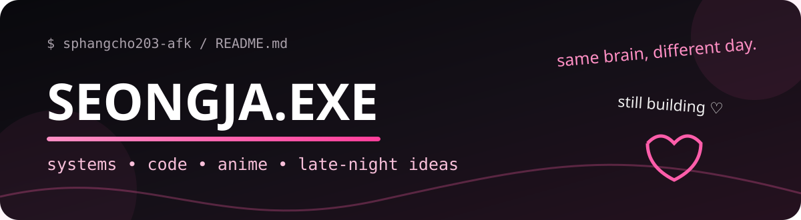
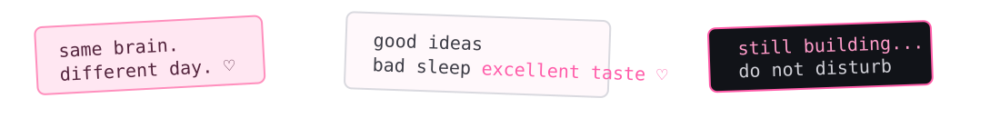

  

  

<table>
<tr>
<td width="19%" align="center" valign="middle">
  
</td>
<td width="62%" valign="middle">

## hey, i'm Seongja ♡

<code>systems</code> · <code>code</code> · <code>anime</code> · <code>games</code> · <code>late nights</code>

I like building things that **actually work underneath the pretty UI** — agent runtimes, web products, automation, integrations, strange experiments, and whatever idea survives long enough to become real.

> curious builder / systems thinker / probably overthinking

</td>
<td width="19%" align="center" valign="middle">
  
</td>
</tr>
</table>

  

<table>
<tr>
<td width="50%" valign="top">

### $ whoami

<pre>
&gt; anime enjoyer
&gt; builder
&gt; jungle main
&gt; systems thinker
&gt; terminal resident
&gt; still figuring it out...
</pre>

</td>
<td width="50%" valign="top">

### 🧠 brain queue

- [x] build things instead of only planning them
- [x] wire tools, APIs, agents & databases together
- [x] make generic interfaces feel less generic
- [ ] finish one idea before spawning five more
- [ ] improve the sleep schedule somehow
- [ ] locate the missing sanity package

</td>
</tr>
</table>

<table>
<tr>
<td width="16%" align="center">
  
</td>
<td width="84%" valign="middle">

### tiny operating rules

**models reason; tools prove** · state needs an owner · failures should be inspectable · recovery is a feature · pretty UI never excuses fake functionality

</td>
</tr>
</table>

---

## &lt;/&gt; tech pile

  

  <code>agents</code>
  <code>MCP</code>
  <code>APIs</code>
  <code>automation</code>
  <code>Android</code>
  <code>tool calling</code>
  <code>web systems</code>

tools, tabs & chaos ♡

---

## ☆ things currently escaping the idea folder

<table>
<tr>
<td width="33%" valign="top">

### 🎮 [Recharza](https://github.com/sphangcho203-afk/recharza-platform)

Game top-up platform with a full storefront/runtime stack.

<code>Next.js</code> · <code>TypeScript</code> · <code>Postgres</code>

</td>
<td width="33%" valign="top">

### 🤖 [Nexus](https://github.com/sphangcho203-afk/ai-chatbot-v1)

Multi-user AI chatbot + user-owned tools and routing.

<code>AI</code> · <code>Agents</code> · <code>Next.js</code>

</td>
<td width="33%" valign="top">

### ⚙️ [Telegram Agent OS](https://github.com/sphangcho203-afk/telegram-agent-os)

Telegram-native agent experiments with MCP/tool execution.

<code>Telegram</code> · <code>MCP</code> · <code>Automation</code>

</td>
</tr>
</table>

  

<table>
<tr>
<td width="22%" align="center" valign="middle">
  
</td>
<td width="56%" align="center" valign="middle">

## ♪ TOYOKI MODE

<code>hand signs → turn → fake tear → bounce → repeat</code>

small dance break between two questionable engineering decisions.

</td>
<td width="22%" align="center" valign="middle">

### playlist.exe

TOYOKI / anime OSTs / whatever keeps the terminal session alive

</td>
</tr>
</table>

---

<table>
<tr>
<td width="62%" valign="middle">

### current vector

<pre>
ideas
  ↓
prototype
  ↓
break it
  ↓
inspect
  ↓
fix
  ↓
ship
  ↺
</pre>

</td>
<td width="38%" align="center" valign="middle">

### still building...

♡ cleaner systems  
♡ stranger experiments  
♡ better interfaces  
♡ more anime stickers  
♡ fewer mysterious bugs

</td>
</tr>
</table>

<b>📁 open the suspicious folder</b>

 

- I care about the real execution path, not just screenshots.
- If an API can fail, the UI should know how.
- If an action matters, verify it.
- If state exists, somebody should own it.
- Weird ideas deserve prototypes before judgment.
- Anime decorations are not technical debt. Probably.

 

  somewhere between reality and anime, still building.  
  <b>BUILD · OBSERVE · VERIFY · RECOVER · SHIP</b>

<!-- public profile only: no credentials, private architecture, or private operational details -->