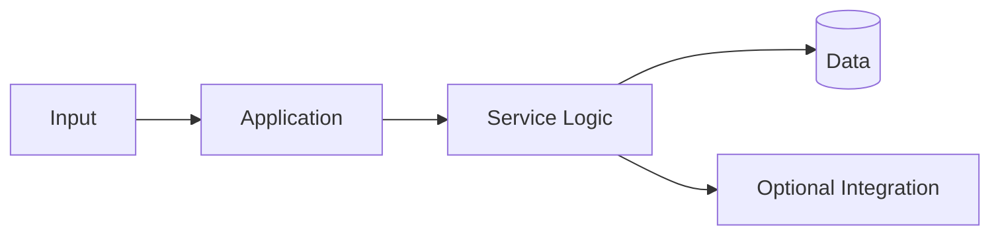

<!--
  SOFT RED README TEMPLATE
  A calm, slightly messy digital-world style for personal projects.
  Replace every [PLACEHOLDER] before publishing.
-->

<p align="center">
  
</p>

<h1 align="center">[PROJECT NAME]</h1>

<p align="center">
  <i>[A simple sentence about what this project is.]</i>
</p>

<p align="center">
  
  
  
</p>

> **a small note about this project**
>
> [Explain what the project does, why it exists, and what kind of problem or curiosity started it. Keep the writing honest and easy to understand.]

<p align="center">
  
</p>

## what this is

[Describe the project in a few friendly paragraphs. Explain the main idea without trying to make it sound bigger than it is.]

## the moving parts

| Part | What it does |
| --- | --- |
| **[Part 01]** | [Short, clear explanation.] |
| **[Part 02]** | [Short, clear explanation.] |
| **[Part 03]** | [Short, clear explanation.] |
| **[Part 04]** | [Short, clear explanation.] |

## features

- [Feature that is already working]
- [Feature that is useful to people using the project]
- [Feature that was fun or interesting to build]
- [Feature that is still being explored]

## tools used

<p align="left">
  
  
  
  
</p>

## getting it running

### requirements

- [Runtime or language version]
- [Database or service requirement]
- [Other requirement]

### installation

```bash
git clone https://github.com/[USERNAME]/[REPOSITORY].git
cd [REPOSITORY]
[INSTALL COMMAND]
```

### configuration

Create a `.env` file using the example below. Keep real credentials out of the repository.

```env
[KEY]=[VALUE]
[KEY]=[VALUE]
[KEY]=[VALUE]
```

### start

```bash
[DEVELOPMENT COMMAND]
```

## routes or commands

| Method | Endpoint / Command | What it does |
| --- | --- | --- |
| `[GET]` | `/[route]` | [Purpose] |
| `[POST]` | `/[route]` | [Purpose] |
| `[ACTION]` | `[command]` | [Purpose] |

```bash
curl -X [METHOD] http://localhost:[PORT]/[ROUTE]
```

## a little map of the project



[Add a screenshot or project-specific diagram here if it helps somebody understand the project.]

## what is next

```text
[ ] [Next small improvement]
[ ] [Something to learn]
[ ] [A bug to understand]
[ ] [An idea for later]
```

## contributing

If you find something interesting, confusing, or broken, feel free to open an issue. Small improvements, kind feedback, and different ideas are welcome.

```bash
git checkout -b feature/[short-name]
[TEST COMMAND]
git commit -m "[short description]"
```

## notes from the desk

[Add an honest closing note about what you learned, what is unfinished, or what you want to explore next.]

<p align="center">
  
</p>

<p align="center">
  <sub><i>made slowly, fixed often, still a work in progress.</i></sub>
</p>

<!--
  Voice guide:
  Keep the README warm, clear, personal, and a little imperfect.
  Avoid dramatic quotes, exaggerated claims, fake confidence, or intimidating language.
  It should feel like opening a project folder in someone's cozy digital room.
-->
