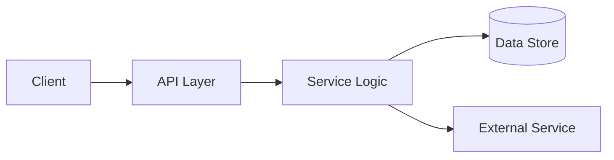

<!--
  CRIMSON CASEFILE README TEMPLATE
  Death Note × Classroom of the Elite inspired.
  Replace every [PLACEHOLDER] before publishing.
-->

<p align="center">
  
</p>

<h1 align="center">[PROJECT NAME]</h1>

<p align="center">
  <i>[One sharp sentence describing the project. Keep it controlled, cold, and specific.]</i>
</p>

<p align="center">
  
  
  
</p>

> **CASE FILE [00] — THE PREMISE**
>
> [Explain what this project does, who it is for, and what problem it solves. Write like an intelligence brief, not marketing copy.]

<p align="center">
  
</p>

## 𝙸. 𝚂𝚢𝚜𝚝𝚎𝚖 𝙾𝚟𝚎𝚛𝚟𝚒𝚎𝚠

```text
[INPUT]  →  [PROCESSING LAYER]  →  [DECISION / OUTPUT]
```

[Describe the architecture in a few precise paragraphs. Explain the important boundaries, data flow, and the design choice that makes this system different.]

## 𝙸𝙸. 𝙵𝚎𝚊𝚝𝚞𝚛𝚎 𝙵𝚒𝚕𝚎

| Capability | What it does |
| --- | --- |
| **[Feature 01]** | [Short, concrete explanation.] |
| **[Feature 02]** | [Short, concrete explanation.] |
| **[Feature 03]** | [Short, concrete explanation.] |
| **[Feature 04]** | [Short, concrete explanation.] |

## 𝙸𝙸𝙸. 𝚃𝚑𝚎 𝙰𝚛𝚜𝚎𝚗𝚊𝚕

<p align="left">
  
  
  
  
</p>

## 𝙸𝚅. 𝙰𝚌𝚌𝚎𝚜𝚜 𝙿𝚛𝚘𝚝𝚘𝚌𝚘𝚕

### Requirements

- [Runtime or language version]
- [Database or service requirement]
- [Environment requirement]

### Installation

```bash
git clone https://github.com/[USERNAME]/[REPOSITORY].git
cd [REPOSITORY]
[INSTALL COMMAND]
```

### Configuration

Create a `.env` file from the example below. Never commit real credentials.

```env
[KEY]=[VALUE]
[KEY]=[VALUE]
[KEY]=[VALUE]
```

### Launch

```bash
[DEVELOPMENT COMMAND]
```

## 𝚅. 𝙰𝙿𝙸 𝙾𝚛 𝙲𝚘𝚖𝚖𝚊𝚗𝚍 𝙸𝚗𝚝𝚎𝚛𝚏𝚊𝚌𝚎

| Method | Endpoint / Command | Purpose |
| --- | --- | --- |
| `[GET]` | `/[route]` | [Purpose] |
| `[POST]` | `/[route]` | [Purpose] |
| `[ACTION]` | `[command]` | [Purpose] |

```bash
curl -X [METHOD] http://localhost:[PORT]/[ROUTE]
```

## 𝚅𝙸. 𝙼𝚒𝚜𝚜𝚒𝚘𝚗 𝙲𝚘𝚗𝚝𝚛𝚘𝚕

```text
[ ] [Milestone one]
[ ] [Milestone two]
[ ] [Milestone three]
[ ] [Milestone four]
```

## 𝚅𝙸𝙸. 𝙰𝚛𝚌𝚑𝚒𝚝𝚎𝚌𝚝𝚞𝚛𝚎 𝙽𝚘𝚝𝚎

[Add a diagram, screenshot, or short explanation of the system's most important internal decision. This is where you show the backend mind behind the project.]



## 𝚅𝙸𝙸𝙸. 𝙲𝚘𝚗𝚝𝚛𝚒𝚋𝚞𝚝𝚒𝚗𝚐

[Explain how another engineer can submit a useful change. Include branch naming, testing expectations, and commit conventions if relevant.]

```bash
git checkout -b feature/[short-name]
[TEST COMMAND]
git commit -m "feat: [short description]"
```

## 𝙸𝚇. 𝙲𝚊𝚜𝚎 𝙲𝚕𝚘𝚜𝚎𝚍

> [End with one original line about systems, discipline, execution, or remaining unreadable to the crowd. Do not use a copied anime quote.]

<p align="center">
  
</p>

<p align="center">
  <sub><i>Built quietly. Tested properly. Released when the system is ready.</i></sub>
</p>

<!-- Optional: add a project-specific screenshot above the System Overview. -->
<!-- Optional: replace external image URLs with local assets under /assets for permanence. -->
<!-- Optional: remove any section that does not apply to the project. -->

## Template voice guide

Use a controlled, intelligent tone. Describe implementation decisions, not exaggerated claims. Prefer phrases such as **control plane**, **service boundary**, **execution path**, **failure recovery**, **data integrity**, and **observable behavior**. Avoid phrases such as “messy cool kid,” “built different,” or generic “future developer” language.

The theme should feel like a private case file: dark, precise, and slightly unreadable to outsiders. The project itself should remain clear enough that another engineer can install it, understand it, and contribute without guessing.

## Credits

This template was designed for **Songja Phangcho** and the `sphangcho203-afk` profile aesthetic.
